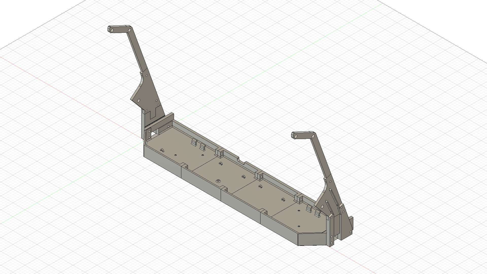
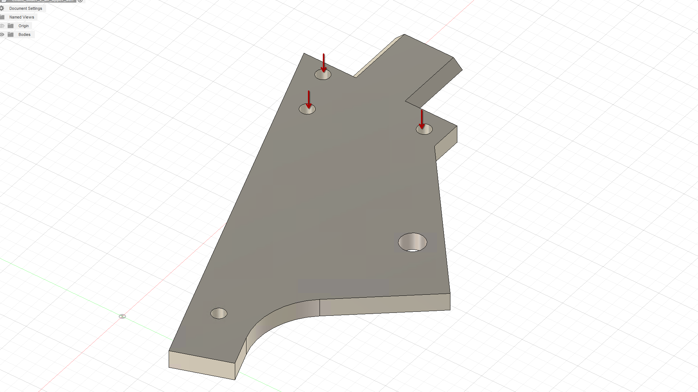
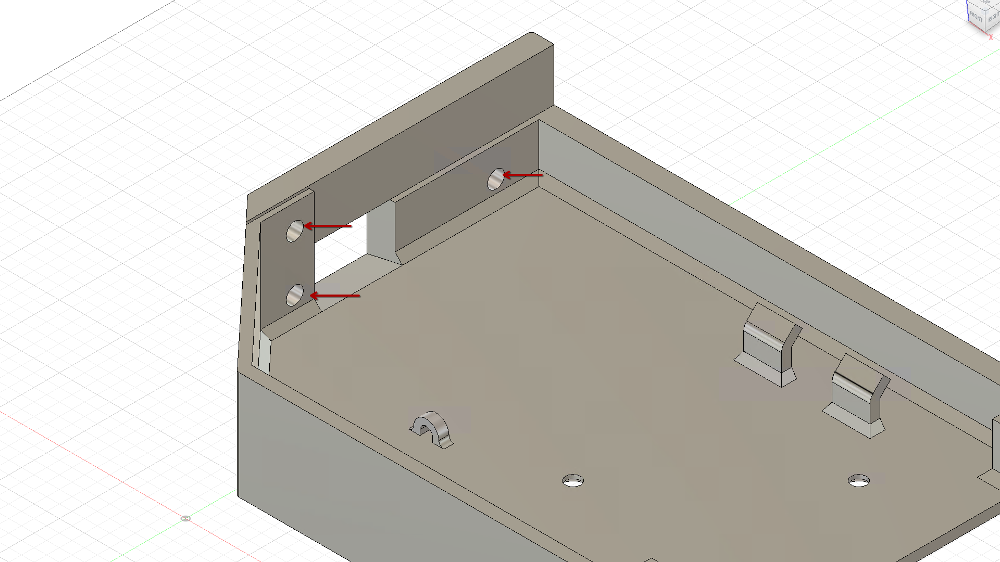
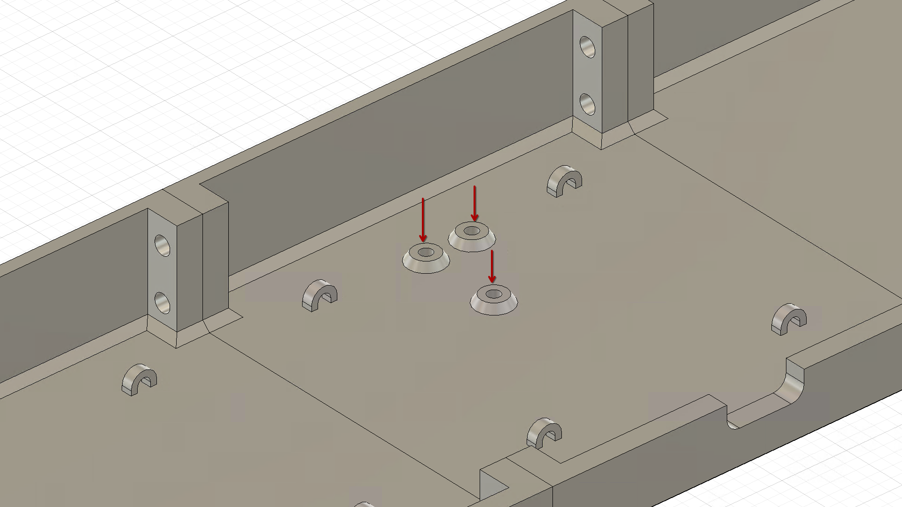

# ChuniCase

3D printable housing for a Chunithm ground slider and air towers

## Parts needed
- 15x M5x25mm bolts
- 4x M5x10mm countersunk bolts
- 6x M4x14mm thumb screws
- 15x M5 heat set inserts (OD 7mm, tip 6.1mm, length 9mm)
- 6x M4 heat set inserts (OD 6MM, tip 5.3mm, length 8mm)
- 3x M3 heat set inserts (OD 5mm, tip 4.1mm, length 4mm)

#### Notes on the heat set inserts

Note that all of the inserts can be replaced with nuts of the respective size, but doing so will require the use of longer bolts, specifically for attaching the air_lower parts to the case (30mm or more) and securing the two air pieces together (18mm or more).
I would strongly advise to not use m4 nuts because the heat set inserts make the air disassembly much easier compared to nuts.

The M3 inserts are optional and used to attach the [airs pcb](https://github.com/Lemony0301/pcb-for-AIR_STRING).

Shorter M4 and M5 inserts can be used if they have the same OD and tip size.

## Printing

All of the STL files are already in the best orientation for printing. Supports are required for the air_lower_support only, and may be required for the outer case parts depending on your printer's bridging capabilities.

I printed the whole case in Overture PETG at 0.28mm layer height on a .4mm nozzle, 4 walls and 15% gyroid infill, but I think any filament will work nicely.

For the right side pieces, just mirror the left side and print. The only exception is the R_case_center part that is different from the left one and is already in the STL folder.

## Assembly

#### Assemble the air towers

disassemble the airs, place the air_upper_support and air_filler_piece between the two casing halves making sure the holes are aligned properly, then screw the airs back together, tightening them enough to keep the pieces secured.

#### Install the heat set inserts in the following locations:

M4:

M5:

M3 (optional):

the remaining M5 inserts can be used in the center case parts.

#### Assemble the case

You can now put together the whole bottom part of the case with the M5 bolts.
After that the air_lower parts can be attached to the case. Do not overtighten these or you will risk pulling the inserts out.

#### Slide in the air towers

The air towers can now be slid into the lower support piece. The dovetail connector is already enough to keep them together but I advise you to use 1/2 M4 thumb screws for each side to have less flex and less risk of the dovetail connector breaking. Feed the cable through the case holes on the sides and optionally tie it with a ziptie using the holes in the air_support_upper piece.

#### Final assembly

After all of the cable management is done you can put the ground slider in place and secure it to the case with the M5 countersunk bolts.
